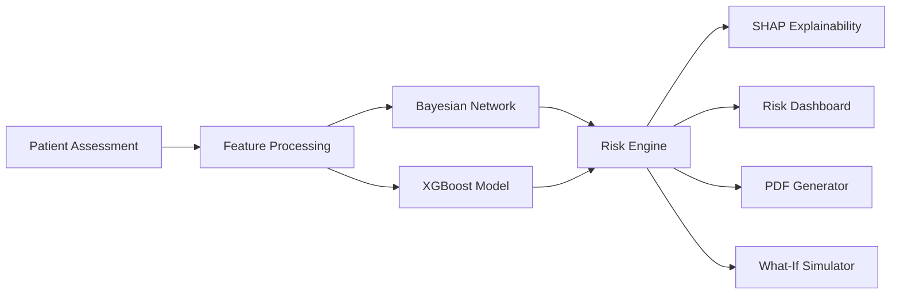
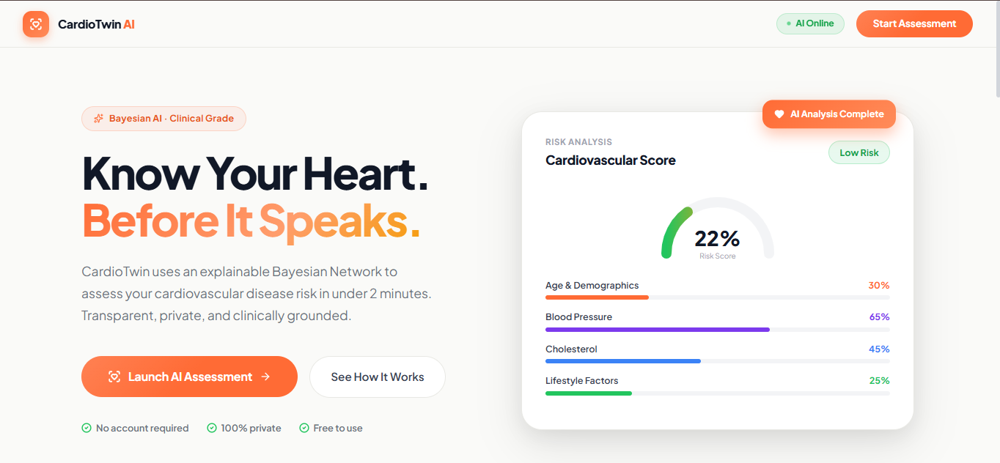
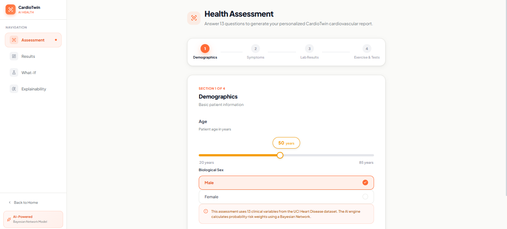
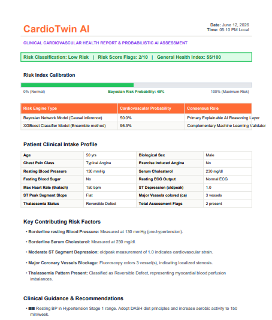
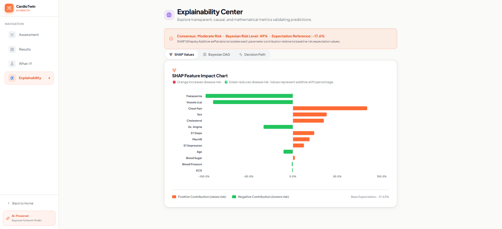
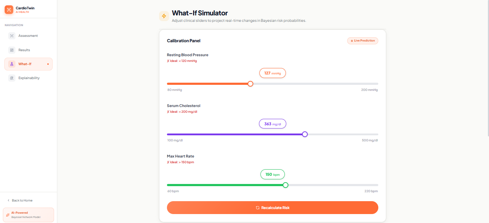

# ❤️ CardioTwin AI

<div align="center">

# Explainable Cardiovascular Risk Intelligence Platform

### Bayesian Networks • XGBoost • SHAP Explainability • Digital Twin Simulation

**Predict. Explain. Simulate. Improve.**


</div>

---

## 🌟 Overview

CardioTwin AI is an Explainable AI-powered cardiovascular risk assessment platform that combines Bayesian Networks, XGBoost, SHAP Explainability, and Digital Twin Simulation to provide transparent heart disease risk prediction.

---

## 🏗️ System Architecture



## 📂 Project Structure

```text
CardioTwin-AI
│
├── backend/
│
├── frontend/
│
├── model/
│   ├── cardiotwin_bayesian_model.pkl
│   ├── heart_cleaned.csv
│   └── heart_bn_ready.csv
│
├── data/
│   └── heart.csv
│
├── docs/
│   └── data_dictionary.md
│
├── assets/
│   ├── screenshots/
│   └── demo/
│
├── README.md
└── .gitignore
```

## 🚀 Installation

### Clone Repository

```bash
git clone https://github.com/mekalakarthik05/CardioTwin-AI.git

cd CardioTwin-AI
```

### Backend Setup

```bash
cd backend

python -m venv venv

# Windows
venv\Scripts\activate

# Linux / Mac
source venv/bin/activate

pip install -r requirements.txt

uvicorn main:app --reload
```

### Swagger Documentation

```text
http://127.0.0.1:8000/docs
```

### Frontend Setup

```bash
cd frontend

npm install

npm run dev
```

### Frontend URL

```text
http://localhost:5173
```

## 📸 Screenshots

### Landing Page



### Assessment Page



### Results Dashboard



### Explainability Center



### Simulator



## 🎥 Demo


## 👨‍💻 Author

### Karthik Mekala

Machine Learning • Deep Learning • Generative AI • Explainable AI

GitHub: https://github.com/mekalakarthik05

## ⭐ Support

If you found this project useful, please consider giving the repository a star.
